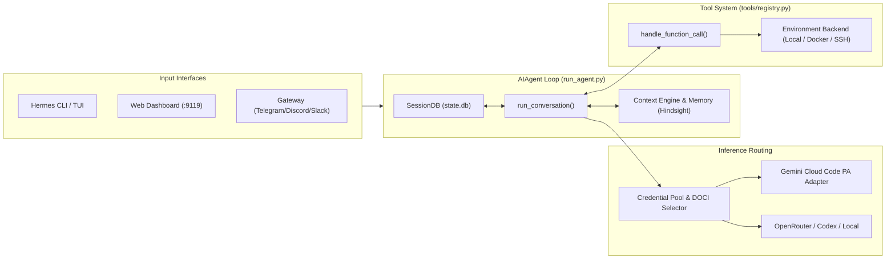

# Hermes Agent — Codebase Architecture & System Reference

This document provides a comprehensive technical overview of the Hermes Agent codebase, its core subsystems, design principles, inference pipelines, and extension layers.

---

## 1. Core Philosophy & Design Invariants

Hermes is designed around two primary architectural principles:

1. **Per-Conversation Prompt Caching is Sacred**:
   - Conversations maintain a byte-stable system prompt and history prefix across turns to achieve high KV cache hit rates (~99%) on upstream backends.
   - Mutating past context, rebuilding system prompts mid-session, or swapping active toolsets during a conversation is prohibited (with the sole exception of context compression).
   - Strict OpenAI message role alternation (`user` $\to$ `assistant` $\to$ `tool`) is strictly enforced; synthetic user turns are never injected mid-turn.

2. **Narrow Core Waist; Capability at the Edges**:
   - Every tool added to the core tool schema is sent on every API turn.
   - New capabilities follow the **Footprint Ladder**:
     $$\text{Extend Existing Code} \longrightarrow \text{CLI Command + Skill} \longrightarrow \text{Service-Gated Tool (\texttt{check\_fn})} \longrightarrow \text{Plugin} \longrightarrow \text{MCP Server} \longrightarrow \text{Core Tool}$$

3. **Session-Scoped Surface Resolution**:
   - Surface availability (e.g. desktop UI panes, in-app browser, project tools) is determined dynamically from the active session's platform metadata, never from backend process environment variables (`HERMES_DESKTOP=1`).

4. **Multi-Profile Dynamic Resolution**:
   - File paths, database files, configuration, logs, and memory resolve dynamically via `hermes_constants.get_hermes_home()` (supporting `~/.hermes` or `~/.hermes/profiles/<profile_name>`). Paths are never hardcoded.

---

## 2. System Architecture & Component Map

```
hermes-agent/
├── Core Engine
│   ├── run_agent.py              # AIAgent class — conversation loop, budget, interrupts
│   ├── model_tools.py            # Tool schema compilation, discovery, and execution dispatch
│   ├── toolsets.py               # Toolset definitions & _HERMES_CORE_TOOLS
│   ├── hermes_state.py           # SessionDB — SQLite FTS5 search, session branching, trajectories
│   ├── hermes_constants.py       # Profile directory resolution (get_hermes_home)
│   └── hermes_logging.py         # Multi-sink logging (agent.log, errors.log, gateway.log)
│
├── Agent Subsystems (agent/)
│   ├── credential_pool.py        # Multi-account pool, DOCI rotation, rate limit tracking
│   ├── gemini_cloudcode_adapter.py # Cloud Code PA client, SSE stream unwrapping, dynamic reasoning
│   ├── gemini_schema.py          # Google OpenAPI schema sanitization for tool declarations
│   ├── transports/               # Chat completions, Codex responses, streaming transports
│   ├── memory/ & context_engine/ # Dual memory architecture, KV cache preservation
│   └── compression/              # Context compression preserving role alternation
│
├── Tool System (tools/)
│   ├── registry.py               # @registry.register decorator, TTL check_fn caching
│   ├── environments/             # Sandboxes: local.py, docker.py, ssh.py, modal.py, daytona.py
│   └── *.py                      # Core tools: terminal, read_file, write_file, web_search, etc.
│
├── CLI & Management (cli.py & hermes_cli/)
│   ├── cli.py                    # Interactive prompt_toolkit REPL, streaming output, history
│   ├── skin_engine.py            # Theming engine, KawaiiSpinner animated progress
│   ├── auth.py & auth_commands.py# Unified OAuth pool, PKCE flow, 5-step quota primer & daemon
│   └── web_server.py             # FastAPI / Tornado backend for Web Dashboard (:9119)
│
├── Messaging Gateway (gateway/)
│   ├── run.py & session.py       # Session multiplexing, cross-platform state routing
│   └── platforms/                # Adapters: Telegram, Discord, Slack, WhatsApp, Signal, Matrix, etc.
│
├── Extensions & Skills
│   ├── plugins/                  # Pluggable memory (Hindsight, Mem0), model providers, Kanban
│   ├── skills/ & optional-skills/# Bundled domain skills (RuleSync-managed)
│   └── cron/                     # Scheduler — jobs.py, scheduler.py
│
└── User Interfaces
    ├── web/                      # React/Tailwind Web Dashboard (built to hermes_cli/web_dist)
    ├── ui-tui/                   # Ink/React Terminal UI (hermes --tui) via tui_gateway/
    └── apps/desktop/             # Electron Desktop application
```

---

## 3. Core Pipelines & Data Flow



---

## 4. Inference & Google Gemini OAuth Architecture

### Multi-Account Unified Provider (`gemini-oauth`)
Hermes consolidates up to 5 Google accounts under a single unified provider slug (`gemini-oauth` / `Google Gemini (OAuth)`):
- **Project Envelope**: Routes inference to `https://daily-cloudcode-pa.googleapis.com/v1internal` with dynamic `cloudaicompanionProject` discovery and `project: "default-cli-project"`.
- **DOCI (Dynamic Opportunity-Cost Index) Rotation**:
  $$\text{Score} = S_{5h}(C_{5h}) \times S_w(C_w, T_w) \times U_{5h}(T_{5h})$$
  Prioritizes burning expiring weekly quotas while preserving mid-cycle replenishment windows.
- **KV Cache Stickiness**: Locks the active account across consecutive session turns to maintain prompt KV caching, failing over to the next healthiest DOCI account immediately upon HTTP 429 (`RESOURCE_EXHAUSTED`).

### 5-Step Verified Quota Ignition Engine & 24/7 Watcher Daemon
Google Cloud Code PA quotas operate on rolling 5-hour replenishment windows that "float" at 100% until the first request in that window occurs. Hermes automatically anchors these countdowns:
1. **Floating Window Detection**: Detects accounts at $\ge 99.99\%$ capacity that have not been primed since the current window began (`_GEMINI_LAST_PRIMED_AT[acc_idx] < window_start_ts`).
2. **Targeted Ignition Ping**:
   - **Gemini Group**: Dispatches on `gemini-3.7-flash-low` with `thinkingLevel: "low"` (`"Say: Ready"`, `max_tokens: 32`).
   - **Claude/GPT Group**: Dispatches on `gpt-oss-120b-medium`.
3. **Immediate Verification**: Queries `:retrieveUserQuotaSummary` 0.5s post-ping to confirm `remainingFraction < 0.9999999` and that a fixed future reset timestamp is actively ticking down.
4. **24/7 Background Daemon**: `start_gemini_quota_watcher_daemon()` runs in thread `gemini-quota-watcher`, polling every 60 seconds across all 5 accounts.

---

## 5. Tool Infrastructure & Execution Environments

- **Tool Registration**: Tools register at import time via `@registry.register(name, description, parameters, check_fn)`.
- **Reachability Gating**: `check_fn` handles reachability checks with TTL caching in `tools/registry.py`.
- **Execution Sandboxes**: The agent delegates tool commands across interchangeable environments:
  - `tools/environments/local.py`: Direct host subprocess execution.
  - `tools/environments/docker.py`: Isolated container execution.
  - `tools/environments/ssh.py`: Remote machine terminal bridging.
  - `tools/environments/modal.py`, `daytona.py`, `singularity.py`: Cloud sandbox runtimes.

---

## 6. Memory & Persistence Architecture

Hermes uses a dual memory architecture:
1. **Built-in Storage**:
   - Markdown memory files: `~/.hermes/memories/USER.md` and `MEMORY.md`.
   - SQLite FTS5 state database: `~/.hermes/state.db` managing session branches, full-text search, and trajectory snapshots.
2. **External Memory Providers**:
   - Supports pluggable memory providers (Honcho, Mem0, Hindsight, Supermemory) configured via `~/.hermes/config.yaml`.

---

## 7. Git Branching Model

The repository maintains clean upstream tracking:
1. **`main`**: Pristine tracker fast-forwarded to upstream `NousResearch/hermes-agent`.
2. **`gemini`**: Feature branch containing Google Gemini OAuth and Cloud Code PA adapters.
3. **`local`**: Active serving branch combining core and local extensions.
