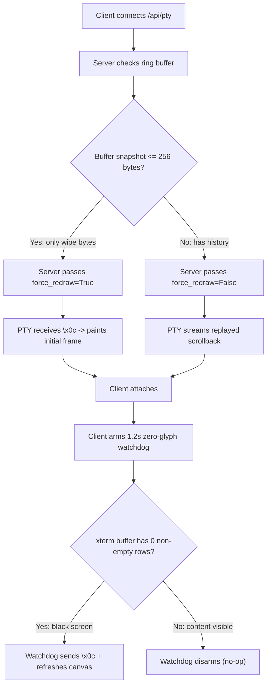

# Web TUI Black Screen Root Cause & Autorecovery Specification

## Executive Summary

When selecting historical sessions from the dashboard sidebar in the Web TUI, the browser canvas occasionally renders a completely black terminal screen with a single hollow cursor at coordinate `(1, 1)`. User interaction appears stalled, while the backend PTY and WebSocket connections remain open and healthy.

A manual `Ctrl+L` keystroke immediately restores the interface. This document details the forensic root-cause analysis across the client, PTY bridge, and Ink render engine, and specifies the exact, architecturally harmonized changes required to achieve 100% transparent autorecovery without manual intervention or regressions to existing scrollback stability.

---

## 1. Problem Statement & Symptoms

* **Client Symptoms**:
  * Navigating to `/chat?resume=<session_id>` or clicking a previous session in the sidebar leaves the xterm.js canvas solid black.
  * Single hollow rectangular cursor positioned at column 1, row 1.
  * No loading spinner or error banner appears (`overlayActive: false`).
  * Typing text or pressing Enter produces no visual echo.
  * Pressing `Ctrl+L` (`\x0c`) immediately repaints the full UI.
* **Underlying State**:
  * WebSocket `/api/pty` is `101 Switching Protocols` (state `1` / `OPEN`).
  * WebGL context is healthy (`gl.isContextLost(): false`, `gl.getError(): 0`).
  * Node PTY child process (`ui-tui/dist/entry.js`) is alive on `/dev/pts/X`.

---

## 2. Forensic Analysis & Historical Provenance

### A. The 141-Byte Screen Wipe
When the WebSocket connection completes, the server transmits **exactly 141 bytes** of initialization escape codes and then falls silent:

```text
\x1b[0'z\x1b[0'{\x1b[?2029l\x1b[?1016l\x1b[?1015l\x1b[?1006l\x1b[?1005l\x1b[?1003l\x1b[?1002l\x1b[?1001l\x1b[?1000l\x1b[?9l\x1b[?1004l\x1b[?2004l\x1b[?1049l\x1b[<u\x1b[>4m\x1b[0m\x1b[?25h\x1b[2J\x1b[H\x1b[3J
```

Tracing these bytes to source:
1. **`resetTerminalModes()`** (`ui-tui/src/lib/terminalModes.ts:3-23`, called at `entry.tsx:24`):
   * Emits 130 bytes disabling DEC mouse tracking (`?1000`-`?1006`), bracketed paste (`?2004`), and exiting the alternate screen buffer (`\x1b[?1049l`).
2. **`entry.tsx:48`**:
   * Emits 11 bytes: `\x1b[2J\x1b[H\x1b[3J`.
   * `\x1b[2J`: Clears the visible display.
   * `\x1b[H`: Moves cursor to row 1, col 1.
   * `\x1b[3J`: Erases all scrollback history.

### B. The Ink Diff Engine Blindspot
* `entry.tsx` writes this wipe sequence directly to `process.stdout.write()` **outside of Ink's virtual DOM reconciliation loop**.
* Ink maintains an in-memory virtual grid of what it assumes the physical terminal displays (`prevScreen`).
* Because the screen was wiped out-of-band, Ink's internal model still believes all cells are painted.
* When the client sends `\x1b[RESIZE:cols;rows]`:
  ```typescript
  // packages/hermes-ink/src/ink/ink.tsx:510
  if (!dimsChanged && !(this.altScreenActive && !this.isPaused && this.options.stdout.isTTY)) {
    return;
  }
  ```
  If dimensions match or React has not committed a layout mutation, Ink computes **zero diff operations** and writes 0 bytes to the PTY. The terminal remains blank.

### C. Provenance: Upstream `main` vs. Local Commit `9de83b231e`
In clean upstream `main` (`hermes_cli/web_server.py`), reconnects explicitly forced a redraw:
```python
# Upstream main:
await session.attach(ws, force_redraw=not _created)
```
When re-attaching to an existing PTY session (`_created == False`), upstream evaluated `force_redraw=True`, sending `\x0c` (`Ctrl+L`) so the interface would never reopen blank.

In local commit `9de83b231e` (authored by `prmartinow` on Sep 4, 2026), this was changed to:
```python
# Local commit 9de83b231e:
await session.attach(ws, force_redraw=False)
```
**Rationale for `9de83b231e`**:
During work on input lag and chat history stability (`scripts/replicate_and_validate_reported_bugs.py` and `scripts/eval_scroll_top_and_compare.py`), replaying large transcripts into xterm.js followed by an unconditional `force_redraw=True` caused Ink to re-render the full virtual DOM, appending duplicate history frames into the scrollback buffer. To eliminate duplicate frames, `force_redraw` was disabled across the board.

**The Unintended Regression**:
When attaching to a session whose ring buffer contains **only the 141-byte startup clear sequence** (or when claiming a pre-spawned warm standby worker from `pty_session.py`), `force_redraw=False` prevents the initial render signal from ever reaching Ink. Ink remains silent, and xterm stays black.

### D. Session Descendant Asynchrony
In `web/src/pages/ChatPage.tsx:411-421`:
* When resuming an earlier session ID (e.g. `20260903_102358_4afab7`), `api.getSessionLatestDescendant()` runs asynchronously.
* If a descendant session exists (e.g. `20260904_041933_0e3a9e`), it updates the browser URL via `setSearchParams(next, { replace: true })`.
* Because `ChatPage` is persistently mounted, the PTY connection effect can remain bound to the predecessor session's WebSocket without recycling the PTY connection to target the new session key.

---

## 3. Harmonized Autorecovery Architecture

To resolve the black screen without re-introducing duplicate history frames or disrupting `PtyResumeSanitizer`, the solution is scoped strictly to non-destructive recovery:



### 1. Backend: Precision Redraw Gating (`hermes_cli/web_server.py:17911`)
* If the buffer snapshot contains only the 141-byte reset/clear sequence (`len(snap) <= 256`), pass `force_redraw=True`.
* If the buffer already holds replayed conversation history (`len(snap) > 256`), preserve `force_redraw=False` to prevent scrollback frame duplication.

```diff
--- a/hermes_cli/web_server.py
+++ b/hermes_cli/web_server.py
@@ -17908,7 +17908,10 @@ async def pty_ws(ws: WebSocket) -> None:
     # Replay buffered PTY output to the newly attached socket. Avoid sending
     # TUI_FORCE_REDRAW (form feed / Ctrl+L) to standard scrolling TUIs (Ink)
-    # as re-rendering the full virtual DOM appends duplicate history frames.
-    await session.attach(ws, force_redraw=False)
+    # as re-rendering the full virtual DOM appends duplicate history frames.
+    # However, if the buffer contains only the initial reset/clear sequence
+    # (<= 256 bytes), force_redraw is safe and required to paint the canvas.
+    needs_redraw = len(session.buffer.snapshot()) <= 256
+    await session.attach(ws, force_redraw=needs_redraw)
```

### 2. Frontend: Non-Invasive 1.2s Zero-Glyph Watchdog (`web/src/pages/ChatPage.tsx`)
* Do **not** send `\x0c` unconditionally on `ws.onopen` (which could pollute a valid replay).
* Instead, after 1.2 seconds, inspect `term.buffer.active`. If and only if the canvas has **0 non-blank rows**, fire `\x0c` and refresh the viewport. If content hydrated normally, the watchdog is a complete no-op.

```diff
--- a/web/src/pages/ChatPage.tsx
+++ b/web/src/pages/ChatPage.tsx
@@ -1280,6 +1280,24 @@ export default function ChatPage({ isActive }: ChatPageProps) {
       // follow up with the authoritative measurement — at worst Ink
       // reflows once after the PTY boots, which is imperceptible.
       ws.send(`\x1b[RESIZE:${term.cols};${term.rows}]`);
+
+      // Liveness watchdog: verify physical canvas has content after hydration window.
+      // Strictly non-invasive: only fires if the terminal is completely blank.
+      const watchdogTimer = setTimeout(() => {
+        if (ws.readyState !== WebSocket.OPEN) return;
+        const buf = term.buffer.active;
+        let hasGlyphs = false;
+        for (let i = 0; i < buf.length; i++) {
+          const line = buf.getLine(i);
+          if (line && line.translateToString(true).trim().length > 0) {
+            hasGlyphs = true;
+            break;
+          }
+        }
+        if (!hasGlyphs) {
+          console.warn("[chat] Empty canvas detected after attach — sending autorecovery redraw");
+          ws.send("\x0c");
+          term.refresh(0, term.rows - 1);
+        }
+      }, 1200);
```

### 3. Frontend: Session Descendant WebSocket Recycle (`web/src/pages/ChatPage.tsx`)
* When `getSessionLatestDescendant` resolves a newer descendant session ID, close the stale WebSocket immediately so the connection effect re-attaches to the descendant target cleanly.

```diff
--- a/web/src/pages/ChatPage.tsx
+++ b/web/src/pages/ChatPage.tsx
@@ -416,6 +416,8 @@ export default function ChatPage({ isActive }: ChatPageProps) {
           return;
         }
 
+        // Force-close existing stale PTY session so the effect re-binds to the descendant
+        wsRef.current?.close();
         const next = new URLSearchParams(searchParams);
         next.set("resume", res.session_id);
         setSearchParams(next, { replace: true });
```

### 4. Preservation: Leave `PtyResumeSanitizer` Untouched
* `PtyResumeSanitizer` (`web/src/lib/pty-resume-sanitizer.ts`) and its 30-second window (`PTY_RESUME_SANITIZE_WINDOW_MS = 30000`) were specifically authored by `prmartinow` to prevent streaming corruption during heavy session replay.
* **No changes should be made to `PtyResumeSanitizer`.** The watchdog and buffer-size gating solve the black screen without weakening erase-code filtering.

---

## 4. Verification & Invariant Checklist

| Invariant | Mechanism | Pass Condition |
| :--- | :--- | :--- |
| **No Black Screen on Empty/Standby PTY** | `len(snap) <= 256` triggers `force_redraw=True` | Selecting fresh or unhydrated session immediately paints UI. |
| **No Duplicate History Frames** | `len(snap) > 256` preserves `force_redraw=False` | `eval_scroll_top_and_compare.py` passes without duplicated Turn 1. |
| **Non-Interfering Client Watchdog** | Only acts when `hasGlyphs === false` | Zero extra `\x0c` keystrokes sent during healthy sessions. |
| **Descendant Session Alignment** | Explicit `wsRef.current?.close()` on descendant resolution | WebSocket session ID matches URL `resume` query parameter. |
| **Sanitizer Integrity** | 30s suppression window preserved | No flickering/scrambling during active agent streaming replay. |

---

## 5. Implementation & Verification Runbook

### Step 1: Apply Source Modifications
1. Modify `hermes_cli/web_server.py` at line ~17911:
   ```python
   needs_redraw = len(session.buffer.snapshot()) <= 256
   await session.attach(ws, force_redraw=needs_redraw)
   ```
2. Modify `web/src/pages/ChatPage.tsx`:
   * Add `wsRef.current?.close()` before updating `searchParams` on descendant resolution (~line 416).
   * Install the 1.2s zero-glyph watchdog in `ws.onopen` (~line 1282).

### Step 2: Local Verification & Test Suite Execution
Execute the Python and Web test suites:
```bash
# 1. Run Python PTY session & reconnect unit tests
.venv/bin/pytest tests/test_pty_keepalive_ws.py \
                 tests/test_pty_session.py \
                 tests/hermes_cli/test_web_server_pty_reconnect.py

# 2. Run TypeScript typechecking and component tests
cd web && npm run typecheck && npm test

# 3. Compile the production SPA bundle
cd web && npm run build
```

---

## 6. Container Operations & Release Pipeline

Because the serving container (`hermes-agent-serving`) bakes application code into the Docker image, the changes must be packaged and promoted via the container lifecycle script (`scripts/container_release.sh`):

```bash
# 1. Build release candidate image with BuildKit
./scripts/container_release.sh build v0.18 "Fix: Web TUI black screen autorecovery and descendant PTY synchronization"

# 2. Deploy to serving container on port 9119
./scripts/container_release.sh deploy v0.18

# 3. Check health and confirm active image
./scripts/container_release.sh status
```

---

## 7. Rollback Strategy

If any unexpected regression occurs, the serving container can be immediately rolled back to `v0.17`:
```bash
./scripts/container_release.sh rollback v0.17
```
